# Parte 2 — Kernel x86_64

**Puntos:** 30 · **Responsable:** [Nombre C]

Kernel mínimo x86_64 siguiendo el tutorial *Write Your Own 64-bit Operating System*.
Build reproducible en Docker con **NASM**, **GRUB (Multiboot2)**, **QEMU**.

## Estado

| Episodio | Objetivo | Estado |
|----------|----------|--------|
| **Episode 1** | Header Multiboot2 + `OK` en `0xB8000` | Estructura lista — ASM pendiente |
| **Episode 2** | GDT + paging + long mode + `main.c` | Pendiente |

## Requisitos

- Docker 24+ y Docker Compose v2
- Make 4.3+
- (Opcional) NASM, GRUB, QEMU en el host para compilar sin Docker

## Inicio rápido (recomendado: Docker)

```bash
cd parte2-kernel-x86_64

# 1. Construir imagen de toolchain (una vez)
make docker-build

# 2. Compilar dentro del contenedor (cuando exista el ASM)
make docker-episode1

# 3. Ejecutar en QEMU
make docker-run
```

En el host (con herramientas instaladas):

```bash
make episode1    # → output/kernel.iso
make run         # QEMU con la ISO
make clean       # Limpia build/, iso/, binarios
```

## Comandos Make

| Target | Descripción |
|--------|-------------|
| `help` | Lista de objetivos (por defecto) |
| `docker-build` | Construye `integrative-kernel-toolchain:24.04` |
| `docker-shell` | Bash interactivo en el contenedor |
| `docker-episode1` | `make episode1` dentro de Docker |
| `docker-run` | QEMU dentro de Docker (con `-display` del host) |
| `episode1` | Ensambla, enlaza y genera `output/kernel.iso` |
| `episode2` | Reservado para long mode + C |
| `clean` | Elimina artefactos intermedios |

## Organización del proyecto

```
parte2-kernel-x86_64/
├── Dockerfile              # Toolchain: NASM, GCC, GRUB, QEMU
├── docker-compose.yml      # Servicio `toolchain` con volumen montado
├── .dockerignore
├── Makefile                # Orquestación build / Docker / QEMU
├── linker.ld               # Script de enlazado (pendiente secciones)
├── grub.cfg                # Entrada GRUB: multiboot2 /boot/kernel.bin
├── config/
│   └── qemu.args           # Flags extra para QEMU
├── src/
│   ├── README.md           # Mapa de episodios
│   ├── boot/               # Episode 1 — Multiboot2 + _start
│   │   ├── README.md
│   │   ├── header.asm      # (pendiente)
│   │   └── boot.asm        # (pendiente)
│   ├── arch/               # Episode 2 — GDT, paging
│   │   ├── README.md
│   │   ├── gdt.asm
│   │   └── paging.asm
│   └── kernel/             # Episode 2 — C
│       ├── README.md
│       ├── main.c
│       └── vga.c
├── scripts/
│   ├── build-iso.sh        # grub-mkrescue → kernel.iso
│   └── run-qemu.sh         # Lanza qemu-system-x86_64
├── build/                  # Objetos .o y .elf (gitignored)
├── iso/                    # Staging temporal para GRUB (gitignored)
└── output/                 # kernel.bin, kernel.iso (gitignored)
```

## Flujo Episode 1

```mermaid
flowchart LR
    ASM["src/boot/*.asm"] --> NASM["nasm -f elf32"]
    NASM --> LD["ld -m elf_i386"]
    LD --> ELF["build/kernel-ep1.elf"]
    ELF --> BIN["output/kernel.bin"]
    BIN --> GRUB["grub-mkrescue"]
    GRUB --> ISO["output/kernel.iso"]
    ISO --> QEMU["qemu-system-x86_64"]
    QEMU --> VGA["Pantalla: OK @ 0xB8000"]
```



## GRUB / Multiboot2

`grub.cfg` declara `multiboot2 /boot/kernel.bin`. El header en `header.asm` debe cumplir la especificación Multiboot2 para que GRUB cargue el kernel.

## Evidencias

Capturas y logs en [docs/evidencias/parte2/](../docs/evidencias/parte2/).

## Troubleshooting

| Síntoma | Posible causa |
|---------|---------------|
| `permission denied` en scripts | `chmod +x scripts/*.sh` |
| GRUB: no multiboot | Header Multiboot2 mal alineado o checksum incorrecto |
| Pantalla negra en QEMU | VGA no escrita; verificar `0xB8000` y atributos de color |
| Docker: UID mismatch | El contenedor usa usuario `builder` (uid 1000) |
