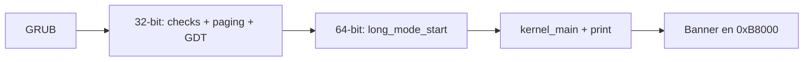

# Parte 2 — Kernel x86_64

** Alex Alban · **Estado:** Completada

Kernel mínimo x86_64 siguiendo el tutorial *Write Your Own 64-bit Operating System*.
Build reproducible en Docker con **NASM**, **GRUB (Multiboot2)**, **QEMU**.

Documentación del proyecto: [README principal](../README.md) ·
[Arquitectura](../docs/arquitectura-laboratorio.md) ·
[Evidencias](../docs/evidencias/lista-evidencias.md) ·
[Defensa oral](../docs/defensa-oral.md)

## Criterios de la rúbrica (checklist)

| Criterio | Cumplimiento | Evidencia |
|----------|--------------|-----------|
| Build reproducible con Docker | `Dockerfile`, `make docker-episode2` | Log build en `docs/evidencias/parte2/` |
| Multiboot2, NASM, GRUB, QEMU | `header.asm`, `grub.cfg`, `run-qemu.sh` | `readelf` + capturas QEMU |
| Episode 1: imprimir `OK` | `make episode1` | `qemu-episode1-ok.png` |
| Episode 2: long mode, paging, GDT, C | `EPISODE2.md`, `src/arch/` | `qemu-episode2-banner.png` |
| Generación de `kernel.iso` | `output/kernel.iso` | `ls -lh output/kernel.iso` |

## Estado

| Episodio | Objetivo | Estado |
|----------|----------|--------|
| **Episode 1** | Header Multiboot2 + `OK` en `0xB8000` | Completado |
| **Episode 2** | GDT + paging + long mode + `main.c` + `print` | Completado |

Documentación detallada de Episode 2: [EPISODE2.md](EPISODE2.md).

## Requisitos

- Docker 24+ y Docker Compose v2
- Make 4.3+
- (Opcional) NASM, GRUB, QEMU en el host para compilar sin Docker

## Inicio rápido (sin sudo — toolchain local)

Si no tienes NASM ni xorriso instalados en el sistema:

```bash
cd parte2-kernel-x86_64
./scripts/setup-local-toolchain.sh   # o: make setup-toolchain
make episode2
make run
```

El Makefile detecta automáticamente `.toolchain/nasm-local` y `.toolchain/local/usr/bin/xorriso`.

## Inicio rápido (recomendado: Docker)

```bash
cd parte2-kernel-x86_64

# 1. Construir imagen de toolchain (una vez)
make docker-build

# 2. Compilar Episode 2 dentro del contenedor
make docker-episode2

# 3. Ejecutar en QEMU
make docker-run
```

En el host (con herramientas instaladas):

```bash
make episode2    # → output/kernel.iso
make run         # QEMU con la ISO
make episode1    # Solo "OK" (regresión Episode 1)
make clean
```

## Comandos Make

| Target | Descripción |
|--------|-------------|
| `help` | Lista de objetivos (por defecto) |
| `docker-build` | Construye `integrative-kernel-toolchain:24.04` |
| `docker-shell` | Bash interactivo en el contenedor |
| `docker-episode1` | `make episode1` dentro de Docker |
| `docker-episode2` | `make episode2` dentro de Docker |
| `docker-run` | QEMU dentro de Docker |
| `build` | Alias de `episode2` |
| `episode1` | Multiboot2 + `OK` en VGA |
| `episode2` | Long mode + C + mensaje del grupo |
| `run` | Compila Episode 2 y lanza QEMU |
| `clean` | Elimina artefactos intermedios |

## Organización del proyecto

```
parte2-kernel-x86_64/
├── EPISODE2.md             # Guía completa Episode 2 (flujo, pruebas, capturas)
├── Dockerfile
├── docker-compose.yml
├── Makefile
├── linker.ld
├── grub.cfg
├── config/qemu.args
├── src/
│   ├── boot/
│   │   ├── header.asm      # Multiboot2
│   │   ├── main.asm        # Arranque 32-bit + transición long mode
│   │   └── main_ep1.asm    # Arranque mínimo Episode 1
│   ├── arch/
│   │   ├── gdt.asm         # GDT 64-bit
│   │   ├── paging.asm      # Huge pages 2 MiB (1 GiB identidad)
│   │   └── long_mode.asm   # Entrada 64-bit → kernel_main
│   └── kernel/
│       ├── main.c          # Mensaje del grupo
│       ├── vga.c           # print() VGA
│       └── vga.h
├── scripts/
│   ├── build-iso.sh
│   └── run-qemu.sh
├── build/                  # Objetos y ELF (gitignored)
└── output/                 # kernel.bin, kernel.iso (gitignored)
```

## Flujo Episode 2 (resumen)



## Evidencias

Capturas en [docs/evidencias/parte2/](../docs/evidencias/parte2/). Ver lista en [EPISODE2.md](EPISODE2.md#capturas-para-el-video-y-readme).

## Troubleshooting

| Síntoma | Posible causa |
|---------|---------------|
| `nasm: command not found` | Usar `make docker-episode2` o instalar `nasm` |
| GRUB: no multiboot | Header mal alineado o checksum incorrecto |
| `ERR: 0/1/2` en pantalla | Verificación fallida (ver EPISODE2.md) |
| Pantalla negra / error GRUB `invalid ELF magic` | La ISO debe llevar el **ELF**, no `objcopy -O binary` |
| `Display 'gtk' is not available` | Normal sin GUI: `make run` usa `-serial stdio`. Instala `qemu-ui-gtk` para ventana VGA |
